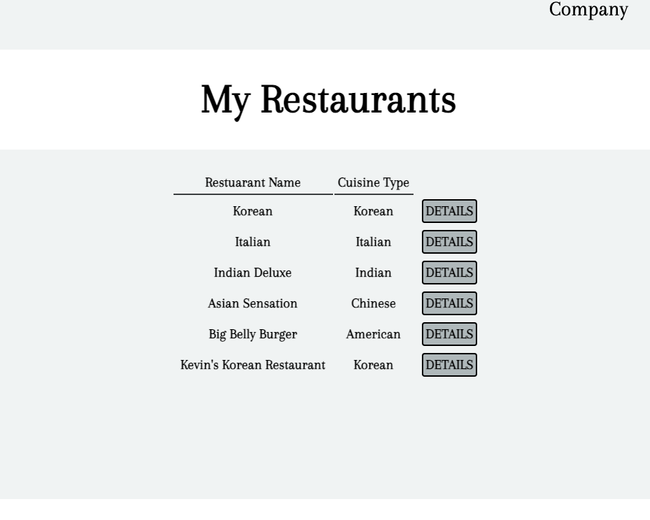

<h1>GuyBean</h1>

GuyBean is a web-based platform offering dine ins bookings by providing time-based discounts of up to 50% off for selected food items.

GuyBean started its production during the second project of General Assembly's Software Engineering Immservie Bootcamp. 

<h1>Visit the site</h1>
[Website]:https://guybean-prototype.herokuapp.com/users/

<h2>GuyBean Homepage</h2>

<h2>Add restaurant</h2>

<h2>View your restaurants</h2>

<h2>View restaurant/restaurants you have added</h2>

<h2>Technologies Used</h2>
* EJS, CSS, JS, Node.JS, MongoDB, Mongoose

<h2>Next Steps</h2>
* Continue working on the database and building more information that restaurant owners can add to their profile
* Have the ability for users to utlizie full CRUD data opreations and not just create
* Organize the routes, models, and controllers folder
